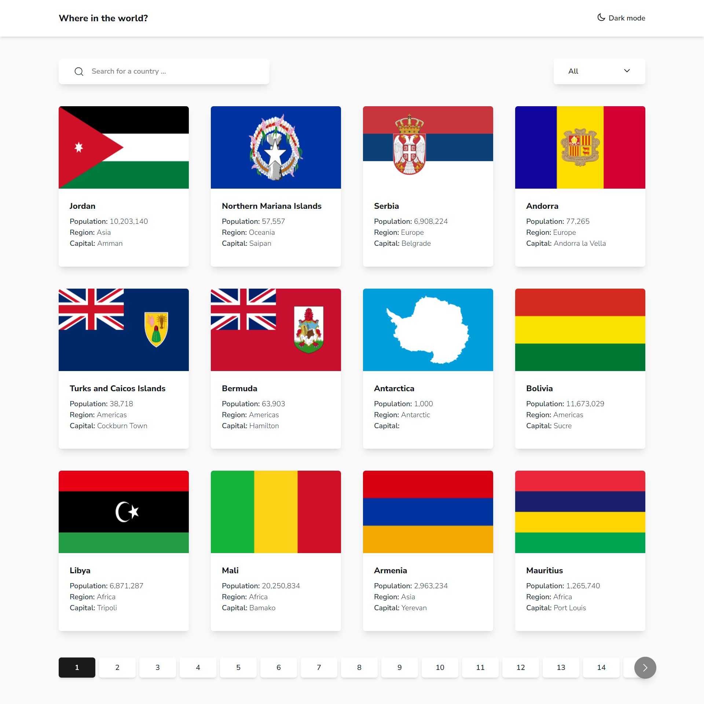
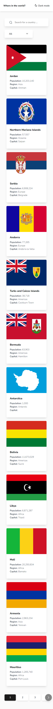

# Frontend Mentor - REST Countries API with color theme switcher solution

This is a solution to the [REST Countries API with color theme switcher challenge on Frontend Mentor](https://www.frontendmentor.io/challenges/rest-countries-api-with-color-theme-switcher-5cacc469fec04111f7b848ca).

## Table of contents

- [Overview](#overview)
  - [The challenge](#the-challenge)
  - [Screenshot](#screenshot)
  - [Links](#links)
- [My process](#my-process)
  - [Built with](#built-with)
  - [What I learned](#what-i-learned)
  - [Continued development](#continued-development)
  - [Useful resources](#useful-resources)
- [Author](#author)
- [Acknowledgments](#acknowledgments)

## Overview

### The challenge

Users should be able to:

- See all countries from the API on the homepage
- Search for a country using an `input` field
- Filter countries by region
- Click on a country to see more detailed information on a separate page
- Click through to the border countries on the detail page
- Toggle the color scheme between light and dark mode.
- Divide results into seperate pages.

### Screenshot

### Links

- Solution URL: [Solution-github](https://github.com/iliassel19/KnowAllCountries)
- Live Site URL: [Live-site](https://fabulous-crepe-bed1d5.netlify.app/)

## My process

### Built with

- [React](https://reactjs.org/)
- [Tailwindcss](https://tailwindcss.com//)
- [React-Router-Dom](https://reactrouter.com/en/main)

### What I learned

For this project, I think that react-router-dom was the main technology that I focused on learning. Fetching data with Suspense and Await combination was very nice way, better for me than creating new Hook or using useEffect. I had some problems at first, because loading state wasn't showing. But after some revison of code and of docs, i figured that we must not await result of a fetch function and leave it as promise to pass it to the defer function in the loader function. Finaly, I think how I split pages and how I organized my files and component is also a major topic that I figured during this project. Also, pagination was my idea to avoid lagging during theme change. Because I noticed that when all countries are rendered in page, switching theme is getting very laggy.

### Continued development

About futur development, I think fetching data and sending data is my weakness. So this is the main focus for me, that i wish to acomplish with complex projects needing requests of posting and geting data from apis or servers.

### Useful resources

- [Pagination](https://www.youtube.com/watch?v=wAGIOCqS8tk&ab_channel=CodeBlessYou) - This helped to build my pagination component without getting into complex trouble.

## Author

- Frontend Mentor - [@yourusername](https://www.frontendmentor.io/profile/iliassel19)
- Github - [@iliassel19](https://github.com/iliassel19)
